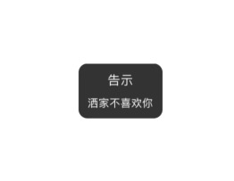

# SCToast
这是一个view的extension,想要弹出一个toast只需要一句代码,支持很多样式.后续会支持多种hud.

## 01样式
code:
```
self.view.makeToast("sb,出错了")
```
style:

<div align=center></div>

## 02样式
code:
```
self.view.makeToast("洒家不喜欢你", "告示")
```
style:

<div align=center></div>

## 03样式
code:
```
self.view.makeToast(UIImage(named: "fast")!)
```
style:

<div align=center></div>

## 04样式
code:
```
self.view.makeToast(UIImage(named: "fast"), "路飞", nil, imageRelativePosition: .upDown, position: .center, duration: 10)
```
style:

<div align=center></div>

## 05样式
code:
```
self.view.makeToast(UIImage(named: "fast"), "路飞通缉令", "路飞这SB,赏金已经达到15亿贝利,我还能更长,路飞这SB,赏金已经达到15亿贝利,我还能更长,路飞这SB,赏金已经达到15亿贝利,我还能更长,路飞这SB,赏金已经达到15亿贝利,我还能更长,路飞这SB,赏金已经达到15亿贝利,我还能更长,路飞这SB,赏金已经达到15亿贝利,我还能更长,路飞这SB,赏金已经达到15亿贝利,我还能更长,路飞这SB,赏金已经达到15亿贝利,我还能更长,路飞这SB,赏金已经达到15亿贝利,我还能更长", imageRelativePosition: .leftRight, position: .center, duration: 10)
```
style:

<div align=center></div>

## 06样式
code:
```
self.view.makeToast(UIImage(named: "fast"), "路飞通缉令", "路飞这SB,赏金已经达到15亿贝利,我还能更长,路飞这SB,赏金已经达到15亿贝利,我还能更长,路飞这SB,赏金已经达到15亿贝利,我还能更长,路飞这SB,赏金已经达到15亿贝利,我还能更长,路飞这SB,赏金已经达到15亿贝利,我还能更长,路飞这SB,赏金已经达到15亿贝利,我还能更长,路飞这SB,赏金已经达到15亿贝利,我还能更长,路飞这SB,赏金已经达到15亿贝利,我还能更长,路飞这SB,赏金已经达到15亿贝利,我还能更长", imageRelativePosition: .upDown, position: .center, duration: 10)
```
style:

<div align=center></div>

